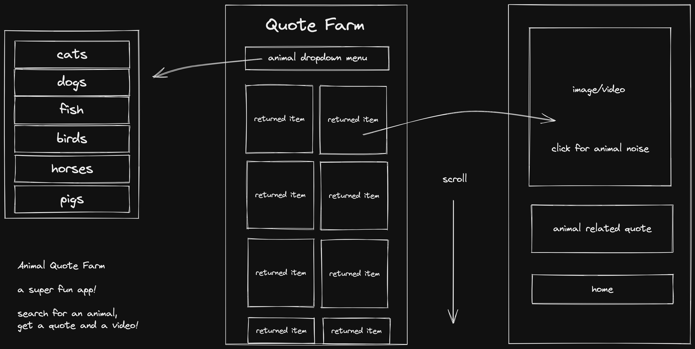
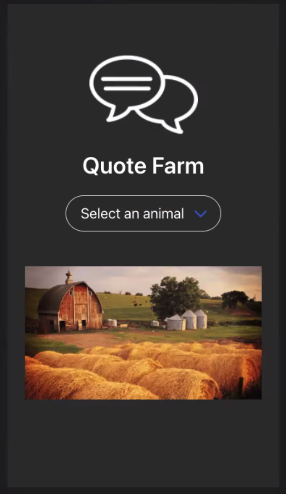
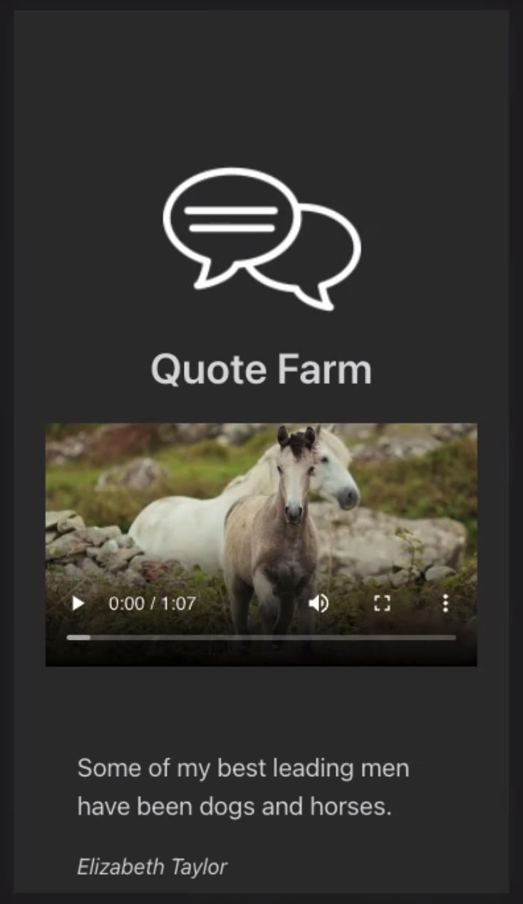

# Quote Farm - SEI Project 2

## Overview

Quote Farm is a pair project I built with JT Black in a 48 hour Hackathon. (Dig the cheeky nod to Orwell’s Animal farm.) It’s a fully responsive fun app that lets the user select videos among 6 animals from Pexels, and once a video is selected, it also shows a quote on the chosen animal randomly fetched from fav.qs

try Quote Farm **[here](https://quote-farm-marco.netlify.app/)**

## Technologies Used

- ReactJS
- Axios http client
- Bulma

## Approach

### 1) Planning

We spent a number of hours trying to find suitable public APIs, i.e. free of charge and with no CORS blocking issues (but more on that below…). Although I’m not particularly fond of CSS libraries, we also decided to use Bulma CSS (strongly solicited and mainly implemented by Jack), and also ended up using some Material UI components. Jack also provided the wireframes:



We organized the work by continuously having zoom meetings every time a feature was done, and decided on the go whether to stick to the plan or vary things, even if ever so slightly.

### 2) Functionality

The user story of the app works like this: one chooses an animal from a list of six, and a number of video previews of that animal would be fetched for the user to choose which one to watch. Once the video is selected, it would appear in a custom player (with a little easter egg to boot) with a random quote regarding the same animal.

  
   
  

As mentioned above the app fetches data from two APIs. The second API (that fetches the quote) is called once the user selects a video, and in order to have the search term available in the single video component I passed it as a second parameter (besides the video’s id) in the url to the component, and then extracted it with the useParams hook exposed by React Router DOM

```
const { id, searchTerm } = useParams();

  const [animal, setAnimal] = useState(null);
  const [quote, setQuote] = useState(null);

  useEffect(() => {
    getSingleAnimal(id).then(({ data }) => setAnimal({ ...data }));

    getQuote(searchTerm).then(({ data }) =>
      setQuote({
        ...data.quotes[Math.floor(Math.random() * data.quotes.length)],
      })
    );
  }, [id, searchTerm]);
```

I also used as usual the then/catch syntax for async calls instead of async/await as I find it cleaner and more succinct.

As hinted before, there is also a nice easter egg (courtesy of Jack): once a user selects a video, the relative audio file of the animal sound would be played. That of course led us to limit the choice of selectable animals to the ones for which we had sound samples.

### 3) Styling

Besides the Bulma library and some custom CSS, since the video previews returned by Pexels were of uneven dimensions, I also used the Masonry component from Material UI for the desktop view of the videos page.


## Wins and Blockers

### Wins

Getting two APIs working together in a functioning React App.

### Blockers

CORS reared its ugly head: notwithstanding the careful choice of the APIs, we didn’t take into account that Pexels would host its videos on a third party service (Vimeo), whose CORS policy was not as lenient. In order to overcome the issue and have the app functioning as planned, we had to resort to the Heroku proxy trick.

### Bugs

None that we experienced.

### Key Learnings

Learning how to use the React Router to pass state around the app and drilling down the data structures returned by the APIs to get the data we needed was definitely a great exercise! Moreover, since my frame of mind leans heavily towards the logical and critical, working with an amazingly creative person like Jack was a lovely experience.
